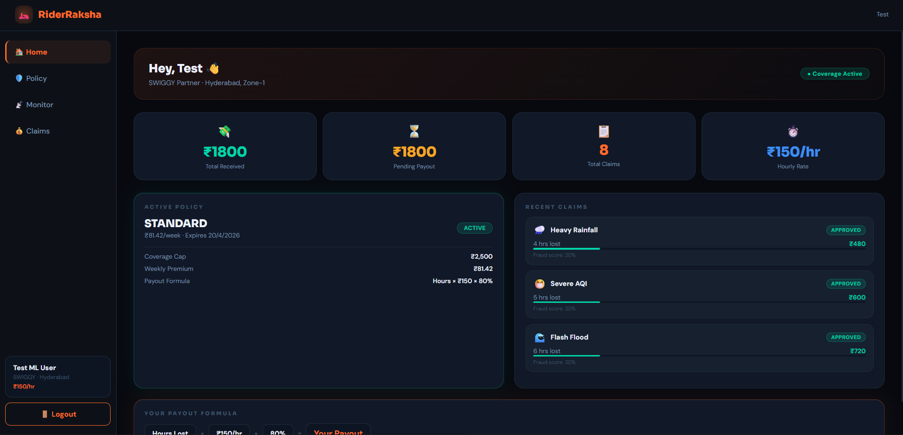
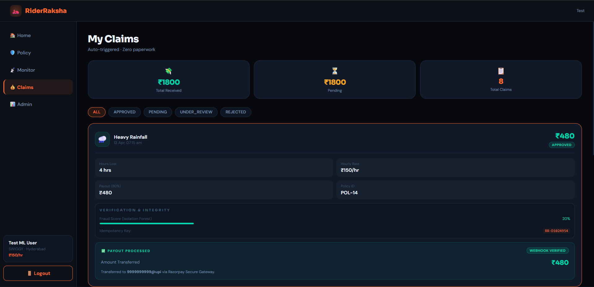
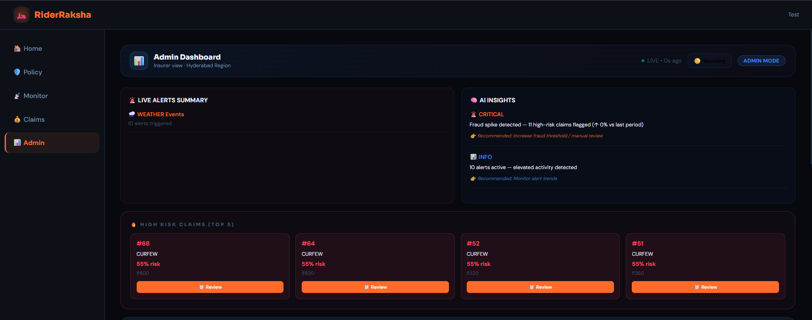
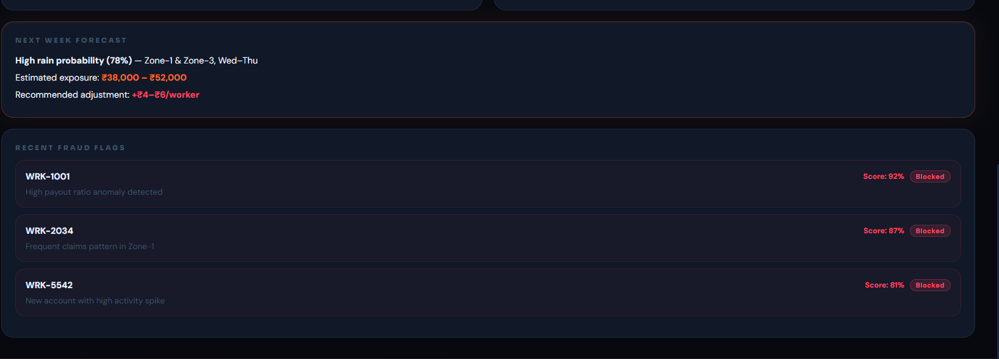
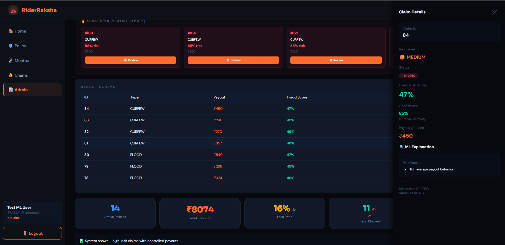

# 🚴‍♂️ RiderRaksha

### AI-Powered Parametric Insurance for Gig Workers

**Guidewire DEVTrails 2026 — Hackathon Submission**

---

## 🎥 Demo & Pitch Deck

👉 **Pitch Deck:** https://docs.google.com/presentation/d/1b4akQt3uw2VLavxYxIcnHF-1O4PuuzJx/edit?usp=drive_link&ouid=117809812464522237292&rtpof=true&sd=true
👉 **Demo Video:** https://your-video-link

---

## 🚀 Overview

**RiderRaksha** is a real-time, AI-driven parametric insurance platform designed for gig workers (delivery riders, drivers, etc.).

It automatically detects disruptions like **rain, pollution, heat, floods, and curfews**, and compensates income loss instantly — **without requiring manual claim filing**.

> 💡 **Core Innovation:**
> Replace traditional claim-based insurance with **automated, data-triggered payouts**.

---

## ⚡ Key Features

* ⚡ **Instant Auto Payouts** — No claim filing required
* 🌦️ **Real-Time Trigger Engine** — Weather, AQI, Heat, Flood, Curfew
* 🤖 **AI Fraud Detection** — Behavioral anomaly detection
* 🧠 **Explainable AI** — Transparent risk scoring & reasoning
* 📊 **Admin Dashboard** — Live analytics, alerts, and insights
* 🔮 **Prediction Engine** — Forecasts claims, fraud, and risk zones

---

## 🧩 System Architecture

```text id="arch01"
Frontend (React)
   ↓
Backend (Flask APIs)
   ↓
ML Layer (Fraud + Prediction + Pricing)
   ↓
Database + External APIs (Weather, AQI)
```

---

## 👥 User Personas

### 👤 Gig Worker

* Purchases policy
* Receives automatic payouts during disruptions
* Tracks claims and earnings

### 🛡️ Admin / Insurer

* Monitors claims and fraud risks
* Reviews high-risk claims
* Uses analytics & AI insights for decision-making

---

## 📊 Product Preview

### 👤 User Dashboard

Shows earnings, active policy, and recent claims


---

### 📄 Claims Page

Track claim status, payouts, and fraud scores


---

### 🛡️ Admin Dashboard

Real-time analytics, alerts, and fraud monitoring


---

### 🤖 AI Insights Panel

Fraud detection insights and recommendations


---

### 🔍 Fraud Review Panel

Detailed claim inspection with ML explanation


---

## 🤖 AI & Machine Learning

| Model             | Purpose                             |
| ----------------- | ----------------------------------- |
| Isolation Forest  | Fraud detection (anomaly detection) |
| XGBoost           | Dynamic premium calculation         |
| K-Means           | Risk segmentation                   |
| Prediction Engine | Claim & fraud forecasting           |

### 🧠 Explainability Layer

Each claim includes:

* Fraud score
* Risk level (LOW / MEDIUM / HIGH)
* Confidence score
* Risk factors
* Recommended action

---

## 🔮 Prediction Engine

The system forecasts future behavior using historical + real-time data:

* Predicted claim volume
* Fraud risk trends
* High-risk zones
* Operational recommendations

**Example Output:**

```text id="pred01"
Predicted Claims: 20  
Fraud Risk: 46% (MEDIUM)  
Top Risk Zone: Zone-1  
Recommendation: Increase monitoring and manual review  
```

---

## 🔐 Fraud Detection Strategy

| Score Range | Action              |
| ----------- | ------------------- |
| < 0.3       | Auto-approve        |
| 0.3 – 0.6   | Monitor             |
| 0.6 – 0.8   | Manual review       |
| > 0.8       | Block + investigate |

---

## 🌦️ Trigger System

| Event  | Threshold    |
| ------ | ------------ |
| Rain   | > 60 mm/hr   |
| Heat   | > 43°C       |
| AQI    | > 350        |
| Flood  | Alert issued |
| Curfew | Zone closure |

---

## 💰 Pricing & Payout Model

| Tier     | Premium  | Coverage |
| -------- | -------- | -------- |
| Basic    | ₹29/week | ₹1,000   |
| Standard | ₹59/week | ₹2,500   |
| Pro      | ₹99/week | ₹5,000   |

**Payout Formula:**

```text id="pay01"
Payout = Hours Lost × Hourly Rate × 80%
```

---

## 📊 Business Model

* Platform fee: **12–15% of premiums**

**Example:**

```text id="biz01"
10,000 users → ₹3 Cr premium  
~13% margin → ₹40 lakh/year  
```

Future Expansion:

* B2B integration with delivery platforms
* White-label insurance solutions

---

## 🛠️ Tech Stack

### Frontend

* React 18, Vite
* Tailwind CSS

### Backend

* Flask, SQLAlchemy
* MySQL / SQLite

### ML

* scikit-learn, XGBoost

### Others

* JWT Authentication
* OpenWeatherMap API
* AQI APIs
* Razorpay (sandbox)

---

## 📁 Project Structure

```text id="struct01"
riderraksha-app/        # Frontend (React)
riderraksha-backend/    # Backend (Flask + ML)
screenshots/            # UI Images
README.md
```

---

## ⚙️ Setup Instructions

### Backend

```bash id="setup01"
cd riderraksha-backend
pip install -r requirements.txt
python run.py
```

---

### Frontend

```bash id="setup02"
cd riderraksha-app
npm install
npm run dev
```

---

## 🚀 Future Scope

* WebSocket real-time streaming
* Advanced fraud detection models
* Cloud deployment (AWS/GCP)
* Integration with Swiggy/Zomato

---

## 👥 Team — Team Elites

* Jathin Sekhar Nerella — Full Stack
* Naga Venkata Balaji — Backend
* Reshma Paavani — AI/ML
* Dhana Laxmi — UI/UX

---

## 📌 Final Note

RiderRaksha reimagines insurance by shifting from **reactive claims** to **proactive protection**, ensuring gig workers receive **instant, fair, and transparent compensation**.

---
